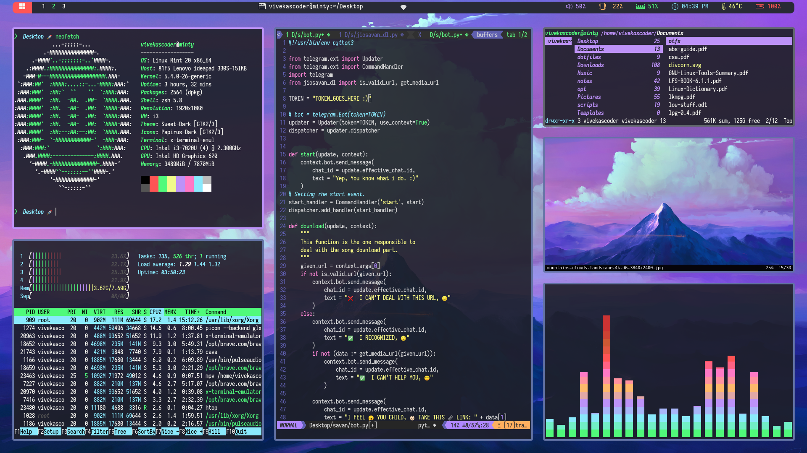
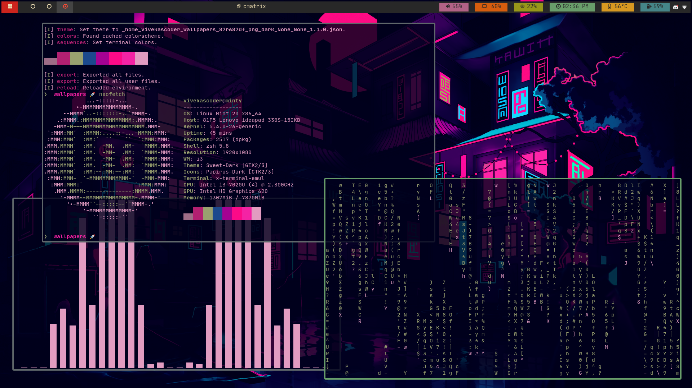
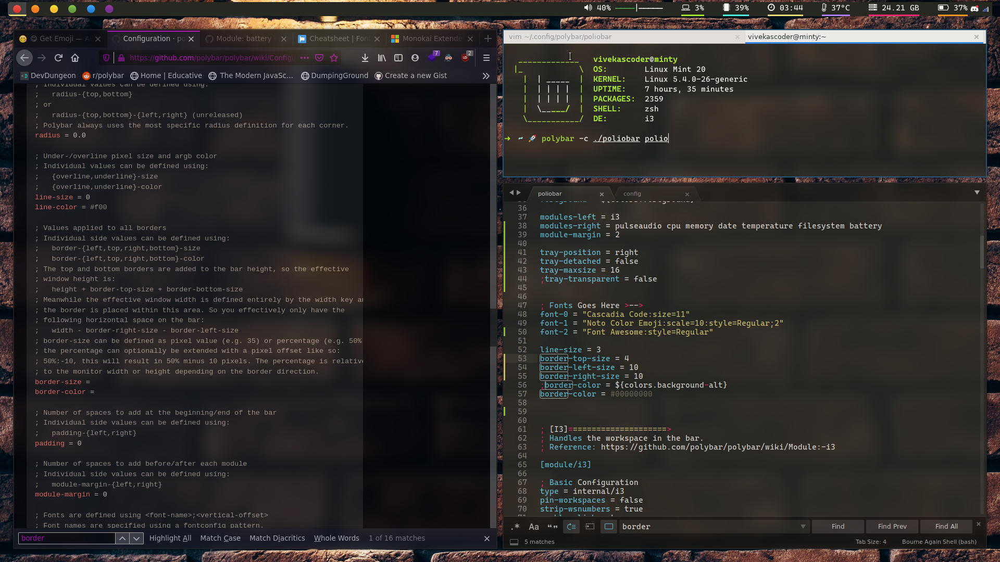

# :snowflake: Dot-Files :rocket:
*These are my dotfiles, none of your dotfiles. :P*

### V3 Polybar screenshot.

- Bar: Polybar `./polybar/v3/`
- Applications: ranger, cava, sxiv, neofetch, htop, neovim
- Font: Iosevka Nerd Font.
- Polybar Icon Font: Custom Patched Font.
  - You can messege me if you want this font.
- Terminal Font: Iosevka Term Nerd Font

## Gruvbox_bar
- Another polybar config based on `Gruvbox Color Scheme`.
- Having the layout as indicated in the above screenshot.
- You can use this config from the `/polybar/gruvbox_bar.cfg`.

 
----
 

### V1 Old Rice.
- Bar: Polybar `./polybar/v1/`
- Applications: xfce4-terminal, firefox, sublime.
- Font: Cascadia Code.
- Polybar Icon Font: FontAwesome5

## :computer: Poliobar
- My custom configuration of polybar, i call it `PolioBar`.
- You can find at `polybar/poliobar`.
- Fonts: `FontAwesome`, `Noto Emoji`, `Cascadia Code`
- FontAwesome: `sudo apt install fonts-font-awesome`

### :rocket: Setup
- Installing Required Fonts.
    + Installing Cascadia Code Font.
    + `sudo apt install fonts-cascadia-code`
    + Installing Noto Font for emoji support.
    + `sudo apt install fonts-noto`
    + Installing the FontAwesome Font for cool unicode symbols.
    + See the Extra Section down in the file where i've mentioned how to install FontAwesome5.
- Installing Polybar
    + `sudo apt install polybar`
- Installing Network Tray.
    + `sudo apt install nm-tray`
- Setting up the configuration file.
    + Copy the `polybar/poliobar` file to `~/.config/polybar/poliobar`
    + > :warning: NOTE: You can also give it the name of `config` but then you need to modify the `launch.sh` file in `poliobar/`.
- Running the Polybar in `i3` or `i3-gaps`.
    + Copy `polybar/launch.sh` from the repository to  `~/.config/polybar/launch.sh`
    + Give the executable permissions to `launch.sh` by.
    + `chmod +x ~/.config/polybar/launch.sh`
    + Now edit your `i3` or `i3-gaps` config at `~/.config/i3/config`.
    + And add the following line to start the polybar when i3 starts.
    + `exec_always --no-startup-id ~/.config/polybar/launch.sh`
    + Another line to enable the network tray.
    + `exec_always --no-startup-id nm-applet`
    + Then just restart your i3 by <key>mod+shift+r</key>.
    + That's it, you now have a complete functional polybar.

#### :earth_asia: Resources
- FontAwesome Cheat Sheet: http://fontawesome.com/cheatsheet
    + Contains the list of all the font's unicode symbols.
- Polybar Wiki: https://github.com/polybar/polybar/wiki
    + Contains the documentation on how to configure polybar.
- Polybar Subreddit: https://www.reddit.com/r/Polybar/
    + It's subreddit of polybar where you can ask questions.
- Text To Ascii: http://patorjk.com/software/taag
    + To generate the ascii text for `poliobar`.
    + You can also use figlet or toilet.

## :v: Get Touchpad Gestures
- **xorg.conf.d**:
- Don't know about you but when i was the DE guy, i used to use the gestures of touchpad.
- So i figure out how to enable some gestures for tilling-wm.

### :rocket: Setup
- Setup necessary files.
    + Goto `/etc/X11/xorg.conf.d/`, create if you don't have these folders. 
    + Then create `90-touchpad.conf` and paste the content from my repository's file.
- Thanks to `Cody Craven` check his article here.
- https://cravencode.com/post/essentials/enable-tap-to-click-in-i3wm/

## :bulb: Extra

### How to install FontAwesome**5** in Debian or any other distro.
- Download the zip file of fonts from the below link.
    + https://use.fontawesome.com/releases/v5.15.1/fontawesome-free-5.15.1-desktop.zip
- Extract it and go the `otf's` folder where you'll find otf files for the fontawesome5 font.
- Install it either by clicking it and installing if you're using a gui font manager.
- If you're not using GUI font installer.
    + Create directory `~/.fonts` if you don't have.
    + Then copy all the OTF files of font to this directory.
- It's a good practice to manually rebuild the font cache so.
    + `fc-cache -f -v`
- Finally you've your FontAwesome5 Font.

### How to setup Mouse Cursor, Icons etc.
- Here, we'll be talking about `lxappearance`.
- **How to install lxappearance**
    + `sudo apt install lxappearance`
- Then open it and change you icons, cursors, etc.
- You can download cursor themes and icon themes from `xfce-look`, 'kde store', `gnome look`, etc.

----

> :speech_balloon: Join Our Community: https://discord.gg/8dC7QAF6r8
